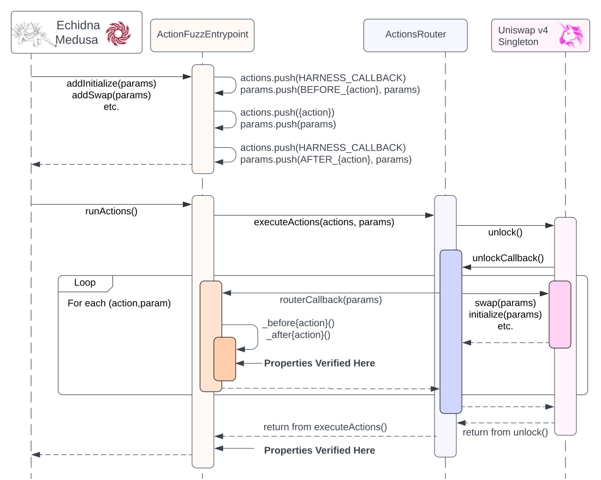

# Stateful Property Test Suite

More information about the stateful property test suite can be found in the [Trail of Bits Audit Report](https://github.com/trailofbits/publications/blob/master/reviews/2024-07-uniswap-v4-core-securityreview.pdf)

`export FOUNDRY_PROFILE=statefulfuzz`

To test the Actions harness, use `forge test --match-contract ActionsHarness_Test -vvv`

To run the Actions harness, install Medusa or Echidna, then use:

`forge clean && forge build --build-info && medusa fuzz`

`echidna ./test/trailofbits/ActionFuzzEntrypoint.sol --contract ActionFuzzEntrypoint --config ./echidna.config.yml`

## Sequence Diagram for Actions harness

